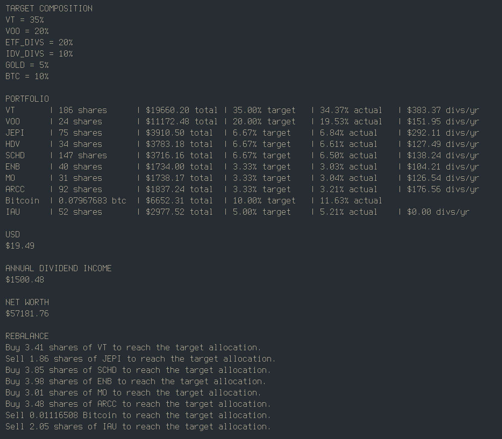

# Portfolio
Design and rebalance a financial portfolio by % allocation. Helped by data scraped from Yahoo Finance.

1) Update `portfolio.json` with your data.
2) Run `server.js`
3) Run `portfolio.py`



## portfolio_server (optional)
Dependencies: *nodejs*

The portfolio data including shares owned, cash held, etc should be stored at a central location. I'm storing it in a JSON file on my homelab and I put a nodejs web server in front of it to serve the JSON data to my client. All this does is serve portfolio.json so that I can have a central place to update my portfolio and so I can run the program from any computer in my house. If you don't want a web server you can store that JSON file directly beside your client script and just have the client script read it from there.

I provided an example portfolio.json which shows the correct format for your data. You should update this file with your most recent data before running the client script. If you want to use a different asset "type" name than me, adjust the code first. You might consider putting portfolio.json in the .gitignore so that your private information is not uploaded via git.

The server runs on port 3007 by default.

```bash
npm install
node server.js
```

## portfolio_client
Dependencies: *Python 3.11+*
The client uses python. Requires the portfolio_server to be running in order to serve the JSON portfolio data. Create a venv, install the required modules bs4 and requests, set the server url in config.toml, then run the script. 

```bash
python -m venv .env
source .env/bin/activate
pip install bs4 requests
python portfolio.py
```

In `config.toml` I direct the client to the local ip of my homelab. You might use `http://localhost:3007/portfolio` instead for testing, I don't know.

```toml
[server]
   url = "http://192.168.0.26:3007/portfolio"
```

